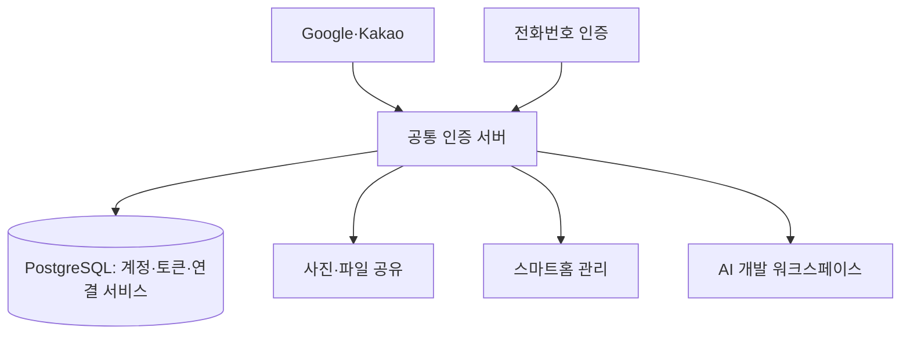

# Unified Auth Server

**여러 개인 웹서비스가 함께 사용하는 공통 계정·인증 서버**

서비스마다 로그인과 사용자 프로필을 중복 구현하는 대신, 계정·소셜 로그인·토큰 발급을 한 서버에서 관리하기 위해 개발했습니다. 사진·파일 공유, 스마트홈 관리, AI 개발 워크스페이스가 공통 계정을 사용하고, 각 서비스의 권한과 업무 데이터는 해당 서비스가 관리합니다.

[실행과 환경 설정](docs/SETUP.md) · [인증 라우트](src/routes/auth.ts) · [소셜 로그인](src/routes/oauth.ts)

## 주요 기능

| 기능 | 구현 내용 | 코드 |
| --- | --- | --- |
| 소셜 로그인 | Google·Kakao 로그인, 신규 프로필 생성, 계정 연결 흐름 | [OAuth 라우트](src/routes/oauth.ts) |
| 토큰 발급·갱신 | 15분 access token, refresh token 해시 저장·회전·로그아웃 | [토큰 모듈](src/lib/tokens.ts), [인증 API](src/routes/auth.ts) |
| 공통 프로필 | 핸들 확인, 표시 이름·아바타·계정 조회·수정 | [인증 API](src/routes/auth.ts) |
| 전화번호 확인 | Twilio Verify를 통한 인증 시작·확인과 요청 제한 | [전화번호 API](src/routes/phone.ts), [제한 로직](src/lib/rate-limit.ts) |
| 연결 서비스 | 서비스 레지스트리, 사용자별 서비스 이용 기록 | [서비스 모듈](src/lib/services.ts), [스키마](prisma/schema.prisma) |
| 계정 이력·삭제 | 로그인 이벤트 조회, 계정 삭제 예약·정리 | [로그인 기록](src/lib/login-events.ts), [계정 삭제](src/lib/account-deletion.ts) |

## 기술 구성

- **서버:** Node.js, TypeScript, Fastify 5
- **저장:** Prisma 6, PostgreSQL 16
- **인증:** Google·Kakao OAuth 연동, JWT, refresh token 해시, Twilio Verify
- **웹·배포:** HTML/CSS/JavaScript 계정 화면, Docker Compose

## 서비스 연결 구조



| 연결 서비스 | 계정 사용 방식 |
| --- | --- |
| [home-media-sharing](https://github.com/ho72/home-media-sharing) | 공통 토큰의 서명·프로필 확인 후 서비스 자체 세션 발급 |
| [smart-home-manager](https://github.com/ho72/smart-home-manager) | Bearer token으로 API 요청, 인증 서버의 `/auth/me`로 프로필 확인 |
| [ai-coding-workspace](https://github.com/ho72/ai-coding-workspace) | 공통 프로필·허용 사용자 목록 확인 후 자체 세션 발급 |

공통 인증 서버는 계정과 토큰을 담당합니다. 사진 앨범 멤버, 스마트홈 구성원·역할, 개발 워크스페이스 접근 목록은 각 서비스가 관리합니다.

## 주요 설계

- 공통 사용자 ID와 외부 로그인 계정을 분리하여 관리하고, 서비스가 같은 ID로 사용자를 식별하도록 구성했습니다.
- refresh token 원문 대신 해시를 저장하고, 갱신 시 기존 토큰을 교체합니다.
- 연결 서비스 정보와 사용자별 이용 기록을 별도 모델로 관리합니다. 등록된 서비스의 Origin과 로그인 복귀 주소의 Origin을 비교해 이용 기록을 연결합니다.

```text
src/routes/       계정·OAuth·전화번호 인증 API
src/lib/          토큰·프로필 연동·요청 제한·로그인 기록
src/plugins/      Prisma 연결
prisma/           PostgreSQL 스키마와 마이그레이션
public/           로그인·계정 관리 웹 화면
docker-compose.yml 앱·PostgreSQL 실행 구성
.env.example      로컬 설정 예시
```

## 실행

Docker Compose로 앱과 PostgreSQL을 함께 실행할 수 있습니다.

```bash
git clone https://github.com/ho72/unified-auth-server.git
cd unified-auth-server
cp .env.example .env
```

`.env`에서 `JWT_SECRET`, DB 접속 설정을 준비한 뒤 실행합니다. 소셜 로그인·전화번호 인증을 이용하려면 해당 제공자의 앱과 인증 설정도 필요합니다. 자세한 내용은 [실행 안내](docs/SETUP.md)를 참고하세요.

```bash
docker compose up --build -d
```

웹은 `http://localhost:4000`, 상태 확인은 `/health`입니다. 기존 이메일·비밀번호 로그인·가입 API는 비활성화되어 있고, 현재 사용자 로그인은 소셜 로그인 흐름을 사용합니다.

## 확인한 범위

임시 PostgreSQL 16과 테스트 계정을 사용하여 서버 시작·상태 확인, 프로필 조회, refresh token 교환·회전과 이전 토큰 거부를 확인했습니다. 세 연결 서비스에서도 이 서버가 발급한 토큰으로 각자의 인증 흐름을 확인했습니다.

2026-10-06 공개 코드 기준으로 Node.js 22.22.2에서 Prisma Client 생성과 `npm run build`가 통과했습니다. 별도의 자동 테스트 명령은 현재 패키지에 없습니다.

Google·Kakao 실제 로그인과 Twilio 문자 인증은 제공자 계정·설정이 필요한 기능이며 이번 검증에서 실행하지 않았습니다. 실제 사용자·토큰·로그인 기록·운영 인증정보는 공개 저장소에 포함하지 않습니다.
